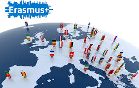

<section class="page-hero">
    

        

            <h1>Fotoğraflar</h1>
            
Erasmus serüveninizi görsellerle keşfedin. Kampüsler, öğrenci yaşamı ve Avrupa deneyimi hakkında ilham alın.

        

    

</section>

<section class="section">
    

        <article class="photo-card">
            
            <h3>Erasmus+ Logosu</h3>
            
Erasmus programının resmi simgesi.

        </article>
        <article class="photo-card">
            
            <h3>Erasmus ve dünya</h3>
            
Yurt dışı deneyimini simgeleyen görsel.

        </article>
    

</section>
